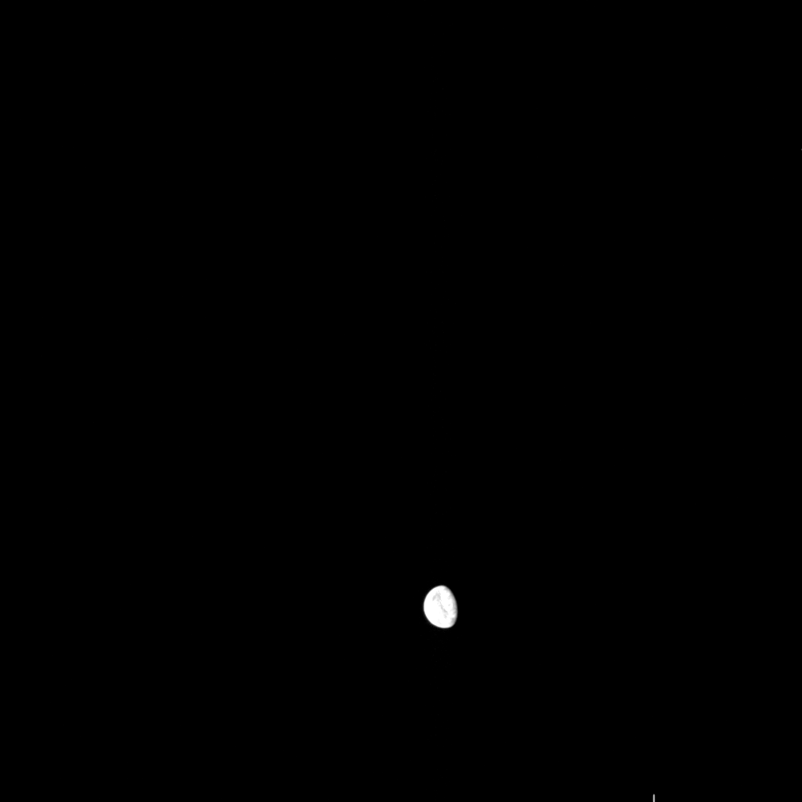
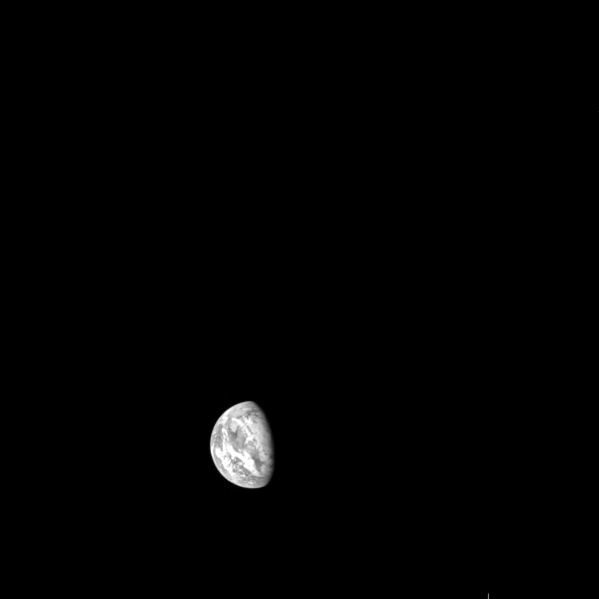
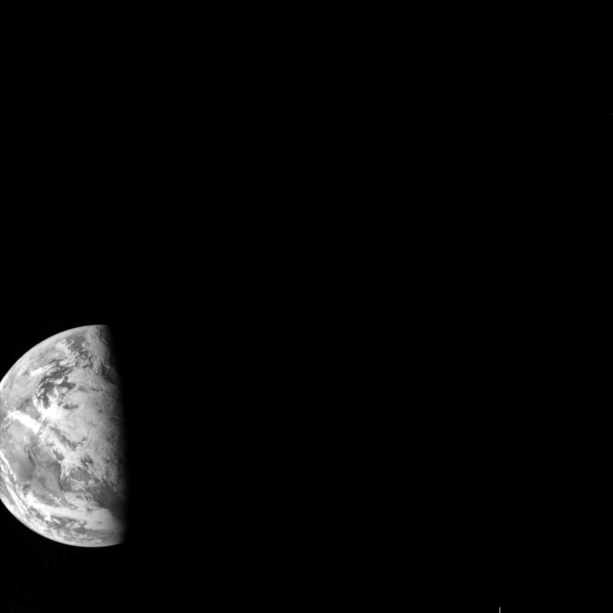
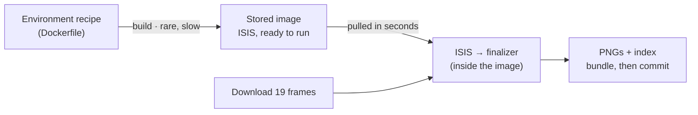
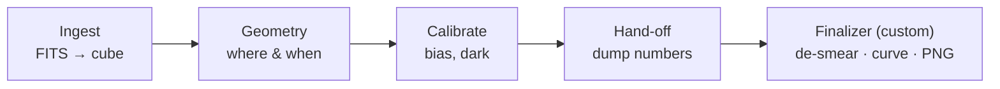

# Building the ONC-W2 flyby pipeline — build report

**Reference** HYB2-EO-PP-2026-001 · **Subject** Hayabusa2 ONC-W2, Earth flyby of 3 December 2015 · **Frames** 19 · **Cost** $0

A plain-language account of the infrastructure, the image-processing steps, and the
eight things that went wrong along the way — for a reader who is neither a
programmer nor an image scientist. An interactive version with diagrams is
published as an [artifact](https://claude.ai/code/artifact/906c44d4-0843-4b48-8647-64afc79f2d4e);
this is the copy of record.

| | | |
|---|---|---|
|  |  |  |
| 00:00 UTC · 202,859 km | 06:59 UTC · 72,287 km | 08:59 UTC · 30,712 km |

Hayabusa2 took these on its way past Earth — a slingshot that bent its path toward
the asteroid Ryugu — using **ONC-W2**, a fixed wide-angle camera the spacecraft
normally uses to find its way, not to take pictures. The project's goal was to turn
that raw instrument data into those pictures, and into a small website that shows
them, **without installing the scientific processing software on a laptop and
without spending any money**.

---

## 1. What was built

Three pieces that fit together:

- A **public code repository** on GitHub holding every script, configuration file, and note.
- An **automated pipeline** — two push-button jobs that run on GitHub's own computers —
  that fetches the source images from NASA's archive, runs them through the scientific
  calibration software, produces finished PNGs plus a small index file, and files the
  results back into the repository.
- A **static web viewer** — a plain page with no server behind it — that reads that
  index and displays the gallery, hosted free at
  <https://freemanjudd.github.io/hayabusa2-onc-pipeline/>.

The source data is the mission's official public archive: the Hayabusa2 ONC bundle at
NASA's Planetary Data System (`urn:jaxa:darts:hyb2_onc`), the same collection
scientists cite in papers. Nineteen wide-angle frames were selected from the flyby's
approach sequence, spanning ten hours as Earth grew from a distant disc to a half-lit
globe leaving the field of view.

---

## 2. The infrastructure

### One constraint shaped everything

The scientific software is **USGS ISIS** — the toolkit NASA and the US Geological
Survey use to process planetary imagery. Installed with its supporting data, it
occupies roughly 40–50 GB. The brief was explicit: none of that on the laptop. So the
governing rule became **ISIS never runs locally — it runs only inside GitHub's
disposable cloud machines**, in a pre-packaged environment that is built once and
thrown away after each run.

That single rule forced a clean split. Every file in the project sits on one side of
a line:

| Runs on your machine — no install | Runs only in the cloud |
|---|---|
| Data downloader — Python (standard library only) | ISIS calibration sequence |
| Image finalizer — Python (standard library only) | The ISIS environment (Dockerfile) |
| Web viewer — HTML / CSS / JS | *(~45 GB lives here, not on disk)* |
| 34 automated tests | |

The left side has no dependencies, so it runs and is tested on any machine. The right
side is quarantined in the cloud. The only thing that crosses back is a handful of
small finished images and a text index.

### Two jobs, not one

Preparing the ISIS environment is slow — the install alone can take the better part
of an hour. Running the actual pipeline against nineteen small images is quick, and
gets repeated every time the processing is adjusted. Bundling both into one job would
mean paying the slow cost on every run, so they are separated:

**The stored image is the hinge.** Job 1 (`build-isis-image`) pays the slow cost once
and parks a ready-to-run ISIS environment in GitHub's registry. Job 2
(`process-images`) pulls it in seconds and does the real work. Job 1 only re-runs when
the environment recipe itself changes.

### Debuggable from the outside

You cannot watch the cloud job run or log into the machine while it works — when
something breaks, all you get is the transcript afterward. Three habits make that
survivable:

- the ISIS step prints everything it does, verbosely;
- the results bundle is uploaded *even when a run fails*, so the log always comes back;
- the job tucks a compressed copy of the calibrated numbers into that bundle — which
  meant the display could be tuned at a desk against real data, with no further cloud runs.

### Testing and cost

Thirty-four small tests run in about three seconds with no network and no ISIS. They
cover the downloader, the index builder, and the finalizer — including synthetic
"smeared frame" and "saturated frame" cases that recreate the hard situations on
demand. Every push also runs automatic style and shell-script checks. Cost stays at
zero because a *public* repository unlocks unlimited free build minutes and free page
hosting; the image registry is free regardless.

---

## 3. What the processing does

A raw frame arrives as a grid of numbers — each number a count of how much light one
sensor pixel collected. Turning that into a faithful picture takes six steps. The
first four are standard ISIS commands; the last is custom code written for this
project.

Steps A–D are the ISIS toolkit; step E is plain Python.

### Ingest — `hyb2onc2isis`

The archive stores images as FITS files, the standard astronomy format. This step
copies the pixel grid into ISIS's own working format (a "cube") and reads across all
the metadata — timestamp, exposure, temperatures. No pixel values change; it is a
container swap.

### Geometry — `spiceinit`

This attaches the spacecraft's reconstructed position and pointing at the moment of
the shot, drawn from *SPICE kernels* — the navigation data NASA and JAXA publish for
every mission. Later steps need it to know the Sun angle and the distance to Earth.
Scoping the download to Hayabusa2 alone kept it to about 1.8 GB instead of the full
multi-mission archive.

### Radiometric calibration — `hyb2onccal`

This is the step that makes the numbers mean something. It removes two known sensor
effects:

- **Bias** — every pixel reports a fixed electronic offset even in total darkness.
  Here it is about 290 counts, subtracted from every pixel.
- **Dark current** — the sensor slowly accumulates a thermal signal in proportion to
  how long the shutter is open. Here it is about 0.05 counts per second — negligible
  for these 3–4 millisecond exposures, but subtracted anyway.

A third correction, *flat-fielding* (evening out pixel-to-pixel sensitivity
differences), needs a reference file that was never produced for this camera, so it
is skipped. The step also attempts to convert counts into physical brightness units,
but the ISIS version lacks the necessary constants for these particular filters — so
the output stays in raw-ish counts. **It does not touch readout smear**, which turned
out to matter a great deal.

### Hand-off — `isis2raw`

The custom finalizer needs the calibrated *numbers*, not a picture, so this dumps the
cube back out as a plain grid of values. The catch: by default this command rescales
the numbers to fit a "typical" brightness window — a stretch. That had to be switched
off so the finalizer received the true values (see problem 6).

### The finalizer — `finalize_png.py`

Custom code, plain Python, no libraries. It does three things.

**1. Readout-smear removal.** ONC-W2 has no shutter. To read a frame, the sensor
shifts every row of collected charge down and off the bottom edge, one row at a time.
While that shift is happening, the sensor is still exposed — so every row, on its way
out, spends a moment sitting under bright Earth and picks up extra light. The result
is a bright vertical band down Earth's column. The first processed frames showed
exactly this: a hard streak straight through the planet.

Why ISIS leaves it alone: a proper correction needs the exact time the sensor takes
to shift one row, and that number was never published for this camera. The finalizer
estimates the smear instead — the thin strips at the top and bottom of every frame
are always empty sky, so whatever brightness shows up there in a given column is the
smear for that column, and it is subtracted from the whole column. The band flattens
into the background.

**2. The display curve.** These exposures were set to catch Earth as a bright dot a
navigation computer could lock onto — not to photograph it. So in the calibrated data
Earth sits near the sensor's ceiling while empty space sits near the floor, with the
interesting detail crammed into the top of the range. Mapped to screen brightness in
the obvious straight-line way, Earth becomes a featureless white blob.

The **asinh** curve (inverse hyperbolic sine) is the standard astronomy answer: steep
where the signal is faint, gentle where it is bright. Earth keeps its shading and its
day/night terminator; the sky stays properly black instead of washing to grey.

**3. A saturated-column guard.** If the smear is strong enough to drive whole columns
to the sensor's absolute maximum, those columns hold nothing to recover, and the code
fills them in from their neighbours. As it happens, the final nineteen frames did not
need this — switching off the hand-off rescale (problem 6) removed the hard ceiling —
but it stays in as insurance, and the tests keep it honest.

---

## 4. What went wrong

The pipeline was not designed and then built. It was built one failing run at a time.
In order:

| # | Problem | | Fix |
|---|---|---|---|
| 1 | **The environment wouldn't verify.** The first cloud build of the ISIS environment failed on a sanity check that called a command (`isisversion`) which does not exist in this build of ISIS. | *infrastructure* | Replaced it with a check of the actual commands the pipeline needs. |
| 2 | **The PNG export refused a setting.** The first real run got all the way through calibration, then failed on the export: the command rejects a bit-depth setting when the output is a PNG, because PNGs are 8-bit by definition. | *syntax* | One line removed. |
| 3 | **A streak through the planet.** The image had a bright vertical band straight through Earth, and Earth itself blown to white. The ISIS documentation revealed the band is *readout smear*, and that this version of the calibration explicitly does not correct it — "we do not have the readout time." | *image science* | The custom finalizer began here: column background subtraction. |
| 4 | **Grey mud and a dark scar.** The first finalizer output had a noisy grey background and a thin dark line where the smear subtraction overcorrected. | *image science* | Tuned against the real calibrated numbers (the ones tucked into the results bundle) rather than guessing: separate the sky level from the per-column smear, set the black point above the noise, set the white point so Earth shows its phase. |
| 5 | **Nineteen of twenty.** Scaling to the full set, the closest frame failed outright: "no usable pixels." Two separate causes hid behind one error (6 and 7). | *image science* | — |
| 6 | **The hand-off was rescaling.** The command that dumps the numbers for Python applies a rescale by default, clipping to a "typical" brightness window. On the near-approach frames, bright Earth *is* the typical brightness, so the window collapsed and every pixel came out flagged as an error. | *image science* | Switched the rescale off (`stretch=none`) — and as a bonus, made every frame's brightness consistent instead of individually auto-scaled. |
| 7 | **The sky wasn't the majority any more.** The smear estimate assumed the empty-sky strips at top and bottom were *mostly* sky. On the near frames the smear reaches those strips across most of the width, so the estimate was biased bright. | *image science* | Take a low percentile of the strip instead of its middle value. |
| 8 | **Earth left the frame — and the site kept the placeholders.** Review showed the last frame was an empty star field: Earth had drifted out of this fixed camera's view near closest approach. Then the final publish appeared to do nothing — the automatic commit carried a `[skip ci]` marker that also skipped the page deployment. | *infrastructure* | Trimmed the set to nineteen; removed the marker so the deploy runs. |

---

## 5. What it is, and isn't

The result is a working, honest exploitation pipeline for a small real dataset.

**What it does**

- Ingests and calibrates real instrument data with the same toolkit professionals
  use, entirely in the cloud.
- Removes readout smear that the standard calibration leaves in.
- Presents Earth with its phase and cloud structure legible, on a properly black sky,
  consistently across ten hours of approach.
- Reproduces from a single button, and documents itself.

**What it doesn't**

- Produce physically calibrated brightness — the output is in sensor counts, because
  ISIS lacks the constants for these filters.
- Remove smear exactly — the true correction constant isn't published; the band goes,
  the extra noise it added stays.
- Un-saturate Earth's bright limb — clipped pixels are gone for good.
- Give science-grade frames — these were navigation snapshots: short exposures, near
  saturation, and Earth exits the view near the end.

---

## 6. Glossary

| Term | Meaning |
|---|---|
| **ONC-W2** | Optical Navigation Camera, Wide-angle 2 — a fixed, wide-field camera Hayabusa2 uses to orient itself. Panchromatic (single greyscale channel). |
| **FITS** | Flexible Image Transport System — the standard file format for astronomical image data and its metadata. |
| **ISIS** | The USGS / NASA toolkit for processing planetary spacecraft imagery. Large; run only in the cloud here. |
| **SPICE** | The navigation data system (positions, pointing, timing) that NASA and partner agencies publish for missions, so imagery can be tied to real geometry. |
| **DN** | Data Number — one pixel's raw count of collected light, before conversion to physical units. |
| **Bias / dark current** | Two signals a sensor records with no real light: a fixed electronic offset, and a slow thermal build-up over the exposure. Both are measured and subtracted. |
| **Readout smear** | Stray light collected by a shutterless sensor while the image is being shifted off the chip — a bright band aligned with the readout direction. |
| **Stretch** | The mapping from sensor counts to screen brightness. "Linear" is a straight line; "asinh" is a curve that favours faint detail. |
| **Saturation** | A pixel at the sensor's maximum. Its true value is unknown and unrecoverable — it can only be shown as white. |
| **GitHub Actions** | GitHub's service for running automated jobs on temporary cloud machines, defined by files in the repository. |
| **GHCR** | GitHub Container Registry — free storage for pre-built environment images, so a slow build is done once and reused. |
| **GitHub Pages** | Free static website hosting served straight from a repository. |

---

*Image data courtesy JAXA / University of Tokyo & collaborators, via NASA PDS Small
Bodies Node (DOI [10.17597/isas.darts/hyb2-00200](https://doi.org/10.17597/isas.darts/hyb2-00200)).
Repository: <https://github.com/freemanjudd/hayabusa2-onc-pipeline>.*
